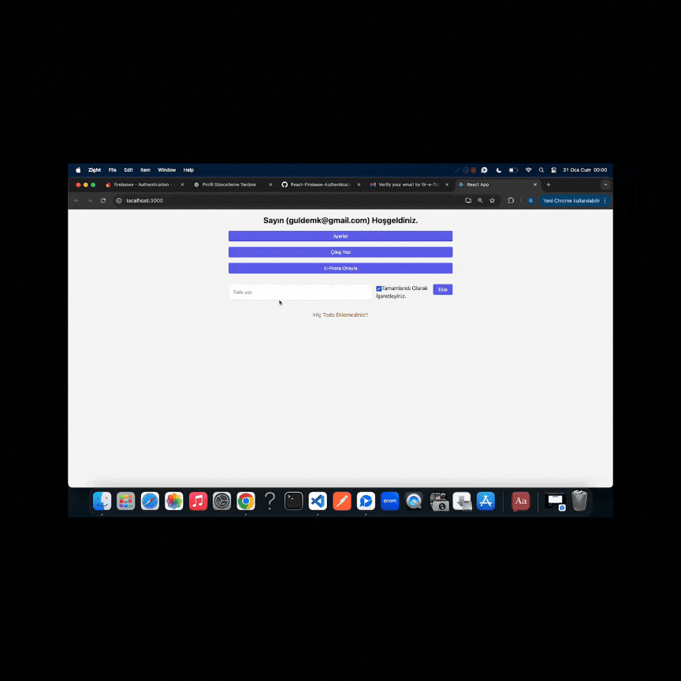

## FİREBASE-AUTH

- Kullanıcı kayıt ve giriş işlemleri
- Profil bilgilerini güncelleme (İsim, Avatar)
- Şifre sıfırlama
- Firebase üzerinden kimlik doğrulama yönetimi

# Kullanılan teknolojiler

- react-router-dom
- firebase
- react-hot-toast -npm install -D tailwindcss - npx tailwindcss init -tailwindui
- @tailwindcss/forms
- npm install @reduxjs/toolkit
- npm install react-redux
- npm install @headlessui/react
- npm install @formkit/auto-animate
- npm i dayjs

- 